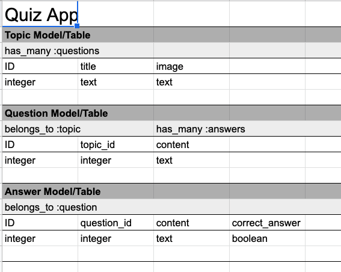
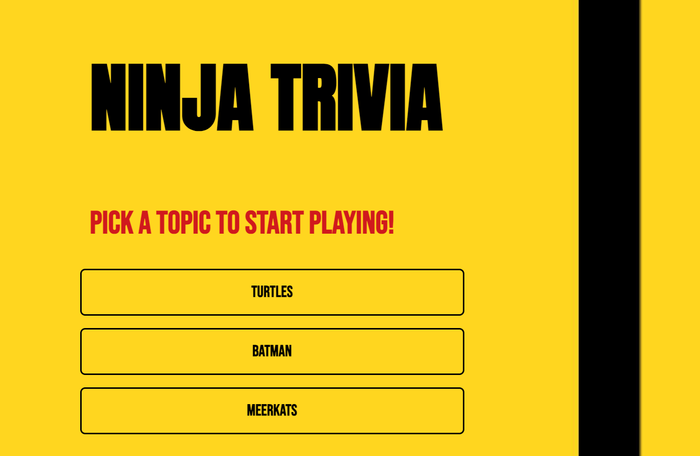

# README

# Project 3: Ninja Trivia App

### The Ninja Trivia App

The purpose of the app is ...

+++

See Ninja Trivia App [here](https://quiz-app-front-end.herokuapp.com/).

We used:
- Ruby on Rails
- HTML/CSS
- Javascript
- React
- +++

### Approach: Ruby on Rails Backend

The models were sketched out in Google sheets to determine the appropriate associations, rows and columns. The data design included 3 models, Topic model, Question model and Answer model. The associations between the three models were has_many / belongs_to associations without any join tables. Topics and Answers were associated through Questions. See table below:





Once the models were sketched out they were migrated into Rails, including the topic_ID and question_ID required to associate Answers, Questions and Topics.

``` rails db:seed ``` command was used to get it running after creating default values in the seed file.

In the Topics controller , JSON data had to be rendered: ``` render json: @topic, :include => {:questions => {:include => :answers}} ``` for the data to be the right shape

### Approach: React Frontend

The frontend....

+++

## Images & Questions Used

The background image was pulled from an external [source](https://wallpapercave.com/wp/wp1817695.jpg)

Below is an example of what the home page of the app looks like.



The questions used were from the following sources:

[Batman source 1](https://www.usefultrivia.com/comic_book_trivia/batman_trivia_index_vii.html)

[Meerkats source 2](https://pdf4pro.com/view/meerkat-quiz-free-kids-quizzes-games-amp-children-s-49d197.html)

[Turtles source 3](https://www.beano.com/posts/its-world-turtle-day-heres-a-quiz-on-turtles)

### Bugs / Fixes

- On the question page react is requesting data recursively which can cause the computer to get overloaded if life on the same page for too alongside

- Questions aren't clickable yet

- After 2 questions users will encounter an error

### Next Steps / Stretch Goals

- De-bugging above issues

- Creating a countdown

- Displaying correct / incorrect

- Allowing more players to play on different computers at the same time

- Keeping score

- A user / Admin log in for users to create their own quiz / questions
